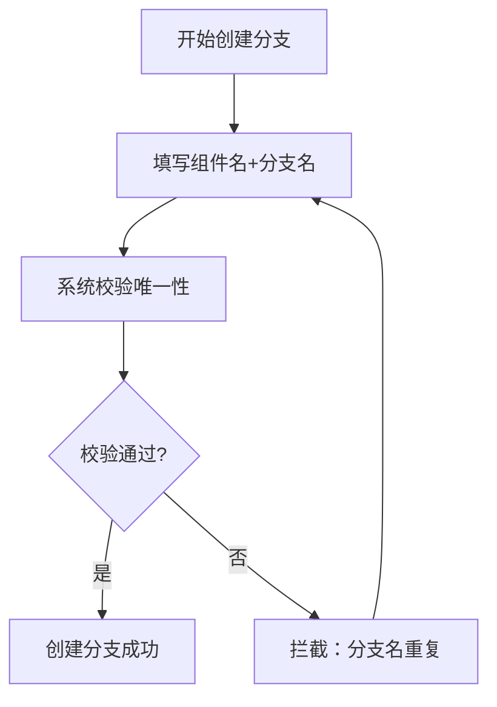
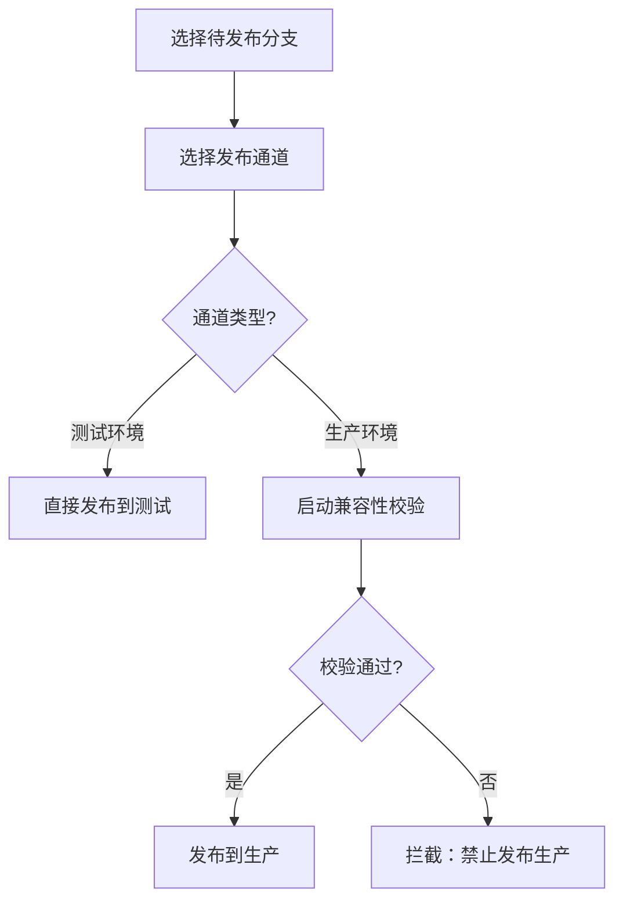

## 1. 产品概述
内部业务组件多版本并行开发管理平台，解决多开发组协同开发时的版本冲突、权限隔离和发布管控问题。
- 核心目标：实现组件分支唯一性校验、开发组权限隔离、测试/生产双环境发布通道、全流程操作审计
- 目标用户：组件开发人员、开发组长、系统管理员

## 2. 核心功能

### 2.1 用户角色

| 角色 | 核心权限 |
|------|----------|
| 开发人员 | 创建组件分支、提交代码、推送测试环境、查看所属组件 |
| 开发组长 | 同开发人员 + 审批生产发布、管理组内成员权限 |
| 管理员 | 全量权限 + 开发组管理 + 权限配置 + 操作日志查看 |

### 2.2 功能模块
1. **组件管理首页**：组件列表、快速统计、搜索筛选
2. **组件分支管理**：创建分支、分支校验、分支列表、分支详情
3. **权限管理**：开发组管理、组件读写权限配置
4. **发布管理**：测试环境发布、生产环境发布、兼容性校验流程
5. **操作日志**：提交日志、发布日志、操作审计

### 2.3 页面详情

| 页面名称 | 模块名称 | 功能描述 |
|----------|----------|----------|
| 组件总览 | 仪表盘 | 组件总数、活跃分支数、发布统计卡片 |
| 组件总览 | 组件列表 | 搜索、筛选、分页展示所有组件 |
| 分支管理 | 创建分支表单 | 组件名、分支名输入 + 唯一性实时校验 |
| 分支管理 | 分支列表 | 展示所有分支，支持按组件/版本筛选 |
| 权限管理 | 开发组列表 | 开发组CRUD、成员管理 |
| 权限管理 | 权限配置矩阵 | 按开发组 × 组件配置读写权限 |
| 发布中心 | 待发布列表 | 展示可发布的分支，区分测试/生产通道 |
| 发布中心 | 兼容性校验 | 生产发布前的强制校验流程 |
| 操作日志 | 日志列表 | 提交/发布操作的完整审计记录，支持筛选导出 |
| 场景模拟 | 测试面板 | 重复创建分支、无权限提交场景快速验证 |

## 3. 核心流程

### 3.1 组件分支创建流程
开发人员填写组件名和分支名 → 系统实时校验同组件下分支名唯一性 → 校验通过创建成功 / 校验失败拦截提示

### 3.2 发布流程
开发人员选择待发布分支 → 选择发布通道（测试/生产）→ 生产通道需先进行兼容性校验 → 校验通过方可发布

### 3.3 权限校验流程
用户发起操作 → 系统查询用户所在开发组 → 校验该组对目标组件的权限 → 无权限则拦截并记录日志

## 4. 用户界面设计

### 4.1 设计风格
- **主色调**：深蓝科技风（#1e3a5f 主色，#3b82f6 强调色，#0ea5e9 辅助色）
- **辅助色**：成功绿 #10b981、警告橙 #f59e0b、危险红 #ef4444
- **中性色**：#0f172a（深背景）、#1e293b（卡片）、#94a3b8（次要文字）
- **布局风格**：侧边栏导航 + 顶部状态栏 + 卡片式内容区
- **按钮风格**：圆角（rounded-lg）、悬停发光效果、渐变色主按钮
- **字体**：JetBrains Mono（代码/标识）+ 系统默认（正文）
- **图标风格**：lucide-react 线性图标

### 4.2 页面设计概览

| 页面名称 | 模块名称 | UI元素 |
|----------|----------|--------|
| 组件总览 | 统计卡片 | 渐变背景、发光边框、数字动画、悬浮上浮 |
| 组件总览 | 组件列表 | 斑马纹表格、行悬停高亮、状态标签颜色编码 |
| 分支管理 | 创建表单 | 实时校验反馈（绿色对勾/红色叉号）、输入抖动动画 |
| 分支管理 | 分支列表 | 版本号标签、分支类型图标、活动状态指示点 |
| 权限管理 | 权限矩阵 | 开关切换、分组折叠、批量操作工具栏 |
| 发布中心 | 通道卡片 | 测试（蓝）/生产（紫）双栏布局，进度步骤条 |
| 操作日志 | 日志条目 | 时间轴样式、彩色操作类型标签、展开详情抽屉 |
| 场景模拟 | 测试面板 | 场景按钮一键触发、结果代码块高亮展示 |

### 4.3 响应式
- 桌面端优先（1440px+），最小支持 1280px
- 侧边栏固定宽度 240px，内容区自适应
- 表格横向滚动支持

### 4.4 视觉动效
- 页面加载：卡片交错淡入（stagger 80ms）
- 校验反馈：输入框边框颜色渐变过渡
- 操作成功：顶部通知滑入 + 自动消失
- 按钮悬停：轻微上浮 + 阴影扩散 + 背景色过渡
