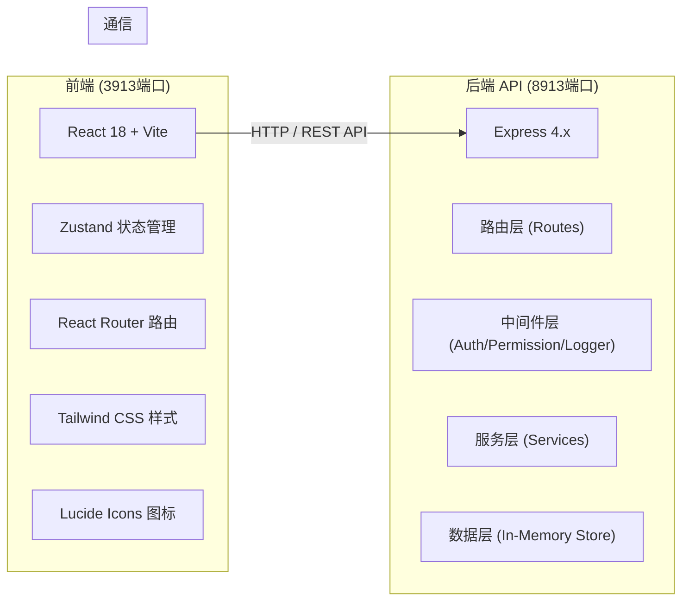
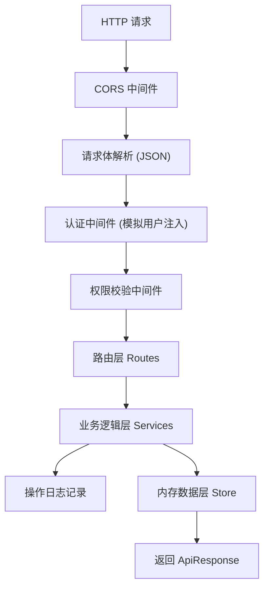
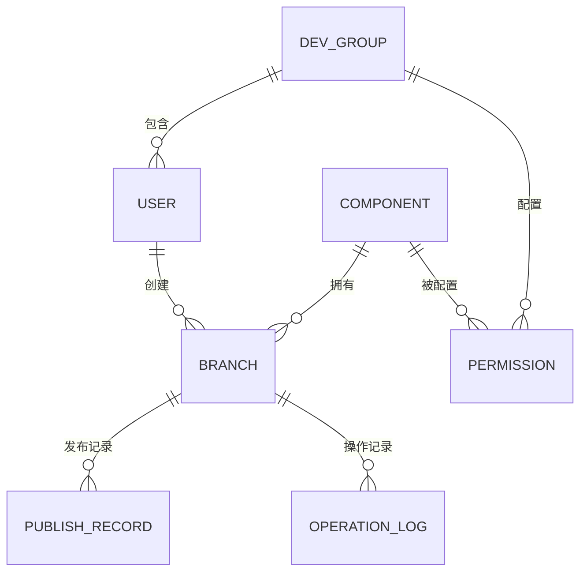

## 1. 架构设计



## 2. 技术描述
- **前端**：React@18 + TypeScript + Tailwind CSS@3 + Vite@5 + Zustand@4 + React Router@6 + lucide-react
- **后端**：Express@4 + TypeScript + CORS中间件
- **数据存储**：内存数据结构（开发演示用），含初始化模拟数据
- **初始化工具**：vite-init（react-express-ts 模板）

## 3. 路由定义

| 前端路由 | 页面 | 说明 |
|----------|------|------|
| / | 组件总览 | 仪表盘 + 组件列表 |
| /branches | 分支管理 | 分支创建 + 列表 |
| /permissions | 权限管理 | 开发组 + 权限矩阵 |
| /publish | 发布中心 | 测试/生产双通道 |
| /logs | 操作日志 | 审计日志列表 |
| /simulator | 场景模拟 | 校验逻辑快速测试 |

| 后端 API 路由 | 方法 | 说明 |
|--------------|------|------|
| /api/components | GET | 获取组件列表 |
| /api/components | POST | 创建新组件 |
| /api/branches | GET | 获取分支列表（支持按组件筛选） |
| /api/branches/check | POST | 校验分支唯一性 |
| /api/branches | POST | 创建分支（含唯一性校验） |
| /api/groups | GET | 获取开发组列表 |
| /api/groups | POST | 创建开发组 |
| /api/permissions | GET | 获取权限配置矩阵 |
| /api/permissions | PUT | 更新权限配置 |
| /api/auth/login | POST | 用户登录（模拟） |
| /api/auth/me | GET | 获取当前用户及权限 |
| /api/publish/test | POST | 发布到测试环境 |
| /api/publish/prod | POST | 发布到生产环境（含兼容性校验） |
| /api/publish/compatibility-check | POST | 执行兼容性校验 |
| /api/logs | GET | 获取操作日志（支持筛选） |

## 4. API 类型定义

```typescript
// 共享类型定义 (shared/types.ts)

interface User {
  id: string;
  name: string;
  role: 'developer' | 'leader' | 'admin';
  groupId: string;
}

interface Component {
  id: string;
  name: string;
  description: string;
  ownerGroupId: string;
  createdAt: string;
  latestVersion: string;
  status: 'active' | 'deprecated' | 'archived';
}

interface Branch {
  id: string;
  componentId: string;
  componentName: string;
  name: string;
  version: string;
  createdBy: string;
  createdAt: string;
  status: 'developing' | 'testing' | 'ready' | 'published';
  compatibilityChecked: boolean;
  lastCommitMessage: string;
}

interface DevGroup {
  id: string;
  name: string;
  memberCount: number;
  memberIds: string[];
}

interface Permission {
  groupId: string;
  componentId: string;
  canRead: boolean;
  canWrite: boolean;
  canPublish: boolean;
}

interface PublishRecord {
  id: string;
  branchId: string;
  componentName: string;
  branchName: string;
  environment: 'test' | 'prod';
  status: 'pending' | 'success' | 'failed';
  operator: string;
  operatedAt: string;
  message: string;
}

interface OperationLog {
  id: string;
  type: 'create_branch' | 'commit' | 'publish_test' | 'publish_prod' | 'update_permission' | 'create_group' | 'permission_denied' | 'duplicate_branch';
  operator: string;
  operatorRole: string;
  target: string;
  detail: string;
  success: boolean;
  timestamp: string;
}

// API 响应结构
interface ApiResponse<T> {
  code: number;
  message: string;
  data: T;
}
```

## 5. 后端服务架构



## 6. 数据模型

### 6.1 ER 关系图



### 6.2 初始模拟数据

```typescript
// 初始开发组
const INITIAL_GROUPS = [
  { id: 'g1', name: '支付业务组', memberCount: 5, memberIds: ['u1', 'u2'] },
  { id: 'g2', name: '订单业务组', memberCount: 4, memberIds: ['u3'] },
  { id: 'g3', name: '用户中心组', memberCount: 6, memberIds: ['u4'] },
];

// 初始用户
const INITIAL_USERS = [
  { id: 'u1', name: '张三', role: 'admin', groupId: 'g1' },
  { id: 'u2', name: '李四', role: 'developer', groupId: 'g1' },
  { id: 'u3', name: '王五', role: 'leader', groupId: 'g2' },
  { id: 'u4', name: '赵六', role: 'developer', groupId: 'g3' },
];

// 初始组件
const INITIAL_COMPONENTS = [
  { id: 'c1', name: 'PayButton', description: '支付按钮组件', ownerGroupId: 'g1', status: 'active', latestVersion: '2.1.0' },
  { id: 'c2', name: 'OrderCard', description: '订单卡片组件', ownerGroupId: 'g2', status: 'active', latestVersion: '1.5.2' },
  { id: 'c3', name: 'UserAvatar', description: '用户头像组件', ownerGroupId: 'g3', status: 'active', latestVersion: '3.0.0' },
  { id: 'c4', name: 'FormValidator', description: '表单校验组件', ownerGroupId: 'g1', status: 'active', latestVersion: '1.0.0' },
];

// 初始分支
const INITIAL_BRANCHES = [
  { id: 'b1', componentId: 'c1', componentName: 'PayButton', name: 'feature-new-ui', version: '2.2.0-dev', createdBy: 'u2', status: 'developing', compatibilityChecked: false, lastCommitMessage: '重构按钮样式' },
  { id: 'b2', componentId: 'c2', componentName: 'OrderCard', name: 'hotfix-discount', version: '1.5.3-hotfix', createdBy: 'u3', status: 'testing', compatibilityChecked: true, lastCommitMessage: '修复优惠计算bug' },
  { id: 'b3', componentId: 'c3', componentName: 'UserAvatar', name: 'feature-animate', version: '3.1.0-alpha', createdBy: 'u4', status: 'ready', compatibilityChecked: true, lastCommitMessage: '增加动画效果' },
];

// 初始权限矩阵 (groupId + componentId -> permission)
const INITIAL_PERMISSIONS = [
  { groupId: 'g1', componentId: 'c1', canRead: true, canWrite: true, canPublish: true },
  { groupId: 'g1', componentId: 'c2', canRead: true, canWrite: false, canPublish: false },
  { groupId: 'g1', componentId: 'c4', canRead: true, canWrite: true, canPublish: true },
  { groupId: 'g2', componentId: 'c1', canRead: true, canWrite: false, canPublish: false },
  { groupId: 'g2', componentId: 'c2', canRead: true, canWrite: true, canPublish: true },
  { groupId: 'g3', componentId: 'c3', canRead: true, canWrite: true, canPublish: true },
  { groupId: 'g3', componentId: 'c4', canRead: true, canWrite: false, canPublish: false },
];
```
